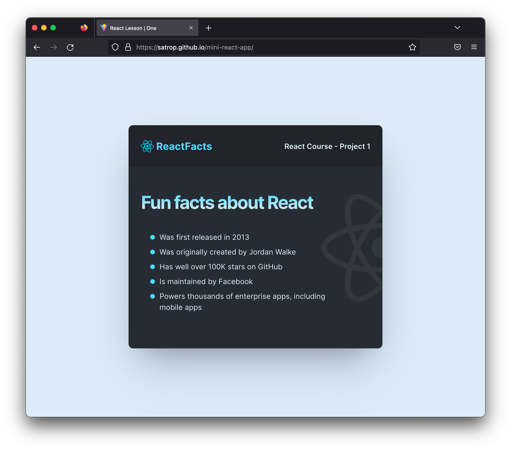

# [Mini React App Project From Scrimba](https://scrimba.com/)

## Overview

### The challenge

-   Get used to working with React
-   Understand how to use React components

### Screenshot

### Links

-   [Solution URL](https://github.com/satrop/mini-react-app)
-   [Live Site URL](https://satrop.github.io/mini-react-app/)

## My process

### Built with

-   Semantic HTML5 markup
-   CSS with custom properties
-   Flexbox
-   Mobile-first workflow
-   [React](https://reactjs.org/) - JS library
